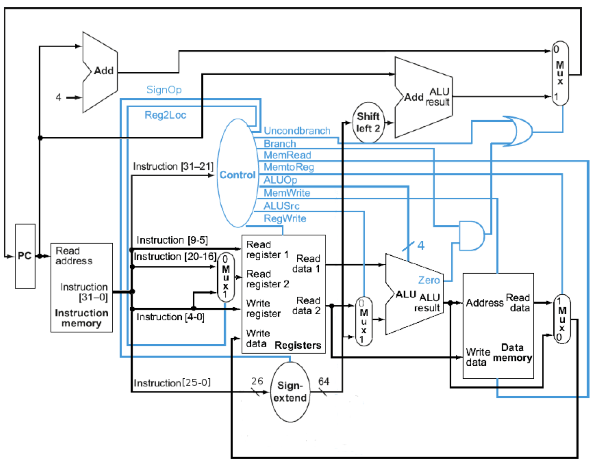

# armv8-single-cycle-cpu-architecture
A Verilog implementation of a single-cycle CPU based on a simplified ARM architecture. Includes instruction fetch, decode, execute, memory, and writeback stages, with support for core instructions (LDUR, STUR, ADD, SUB, AND, ORR, CBZ, B) and an extended MOVZ instruction.

## Project Overview
This design implements the **datapath and control logic** of a single-cycle processor modeled after the ARMv8 ISA.  
All stages execute within one clock cycle, demonstrating the fundamental pipeline structure without hazards.

## Components
- **Instruction Memory** – stores and fetches instructions  
- **Register File** – 32 general-purpose registers  
- **ALU** – performs arithmetic and logical operations  
- **Data Memory** – supports load/store (`LDUR`, `STUR`)  
- **Control Unit** – decodes opcodes and generates control signals  
- **Sign Extender** – handles immediate values  

## Testing
Simulation performed in **Icarus Verilog** with provided testbenches (`*.vcd` and `*_tb.v`).  
Waveforms verified using **GTKWave**.

## Future Additions (Not incorporated in current model)
- Add **branch prediction** or **pipelining**
- Integrate **hazard detection** and **forwarding**
- Expand instruction support (e.g., `ADDI`, `CMP`, `MOVK`)
